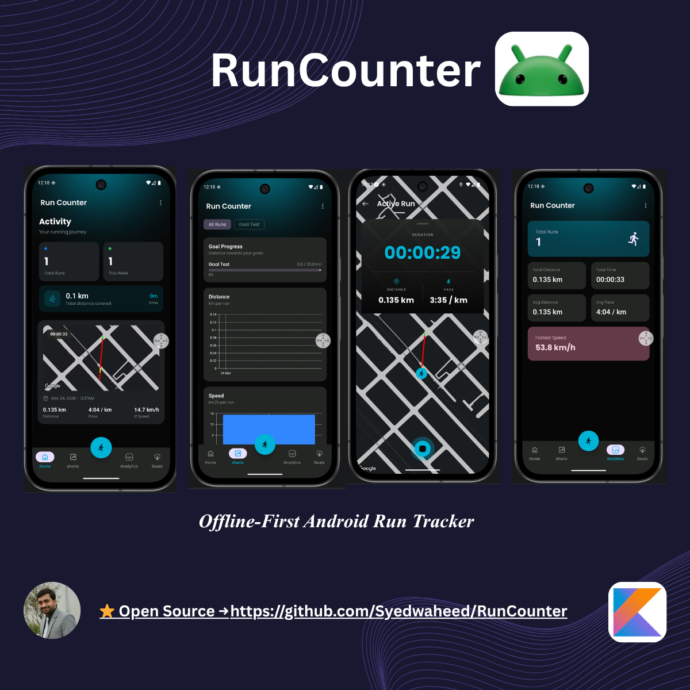
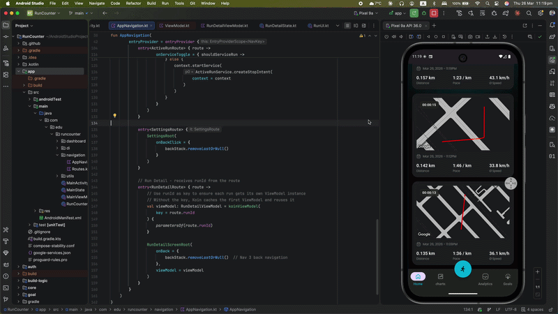

<div align="center">

# 🏃‍♂️ RunCounter

### Offline-First Fitness Tracker for Android

[](https://kotlinlang.org)
[](https://developer.android.com/jetpack/compose)
[](https://android.com)
[](LICENSE)

> Track your runs, distance, and duration — even with zero connectivity.

---

<!-- ============================================================
     SCREENSHOT: Replace the src below with your actual image path
     after uploading to GitHub. Example:
       
     Or if uploaded via GitHub Releases:
       
     ============================================================ -->




</div>

---

## 📽️ Demo

<!-- ============================================================
     VIDEO: GitHub doesn't embed .mp4 files directly in READMEs.
     Best approach for your 126 MB video:

     STEP 1 — Upload via GitHub Releases (supports up to 2 GB):
       1. Go to your repo → Releases → "Create a new release"
       2. Attach your .mp4 file to the release assets
       3. Copy the direct download URL (right-click → Copy link)

     STEP 2 — Use a clickable thumbnail in the README:
       Replace the image path and URL below with your actual values.

     The pattern is:
       [](https://link-to-your-video)
     ============================================================ -->

<div align="center">



</div>

---

## ✨ Features

| Feature | Description |
|---|---|
| 📍 **Real-Time Run Tracking** | Records live GPS location, calculates total distance and current pace |
| 🔄 **Offline-First** | Saves all sessions locally with Room Database — no connection required |
| 🔔 **Background Tracking** | Foreground service keeps tracking active when the app is in the background |
| 🔁 **Auto Sync** | WorkManager pushes queued runs to the server automatically when connectivity is restored |
| 📊 **Run History** | Browse and review all past sessions with time, distance, and pace data |
| 🧭 **Modern UI** | Fully built with Jetpack Compose for a smooth, reactive experience |
| 🔐 **Authentication** | Secure bearer-token auth via Ktor with automatic token refresh |
| 🎯 **Goal Tracking** | Set and track personal running goals *(in development)* |


---

## 🏗️ Architecture

RunCounter is a **multi-module Android application** built on **Clean Architecture** with an **MVI (Model-View-Intent)** pattern. Each feature is isolated in its own set of modules, ensuring clear separation of concerns, independent testability, and scalability.

### Module Structure

```
RunCounter/
│
├── app/                          # App entry point, Navigation, MainActivity
│
├── core/
│   ├── domain/                   # Pure Kotlin — domain models, repository interfaces, Result<D,E> type
│   ├── data/                     # Repository implementations, OfflineFirstRunRepository
│   ├── database/                 # Room database, entities, DAOs
│   └── presentation/
│       ├── designsystem/         # Theme, colors, typography, reusable Compose components
│       └── ui/                   # UI utilities, text formatting helpers
│
├── auth/
│   ├── domain/                   # Auth models & repository interfaces
│   ├── data/                     # Auth repository implementation
│   └── presentation/             # Login / Register screens
│
├── run/
│   ├── domain/                   # Run models, RunningTracker (Flow-based)
│   ├── data/                     # Run repository implementation, sync entities
│   ├── location/                 # Play Services Location, GPS tracking
│   ├── network/                  # KtorRemoteRunDataSource — API calls
│   └── presentation/             # Active run & run overview screens, ActiveRunService
│
├── goal/
│   ├── domain/                   # Goal models & repository interfaces
│   ├── data/                     # Goal repository implementation
│   └── presentation/             # Goal screens (in development)
│
└── build-logic/
    └── convention/               # Gradle convention plugins for consistent module setup
```

### Convention Plugins

Each module uses a convention plugin in its `build.gradle.kts` to keep configuration consistent:

| Plugin | Used For |
|---|---|
| `runcounter.android.application.compose` | App module with Compose |
| `runcounter.android.library` | Standard library module |
| `runcounter.android.library.compose` | Library module with Compose |
| `runcounter.android.feature.ui` | Feature presentation modules |
| `runcounter.android.room` | Modules using Room (enables KSP) |
| `runcounter.jvm.library` | Pure Kotlin/JVM modules |
| `runcounter.jvm.ktor` | Modules using Ktor networking |

---

### MVI Pattern

Every feature follows a strict MVI structure inside its `presentation` module:

```
┌─────────────────────────────────────────────────────────┐
│                        Feature                          │
│                                                         │
│  State (data class)   — immutable snapshot of UI state  │
│  Action (sealed)      — user/system intents             │
│  Event (sealed)       — one-time side effects (Channel) │
│  ViewModel            — onAction(), mutableStateOf()    │
└─────────────────────────────────────────────────────────┘
```

```
User Interaction
      │
      ▼
  Action (sealed interface)
      │
      ▼
  ViewModel.onAction()
      │
      ├──► UseCase ──► Repository ──► Room DB (local)
      │                          └──► Ktor API (remote)
      │
      ▼
  State updated via .copy()
      │
      ▼
  Compose UI recomposed
      │
      ▼
  Event (one-time, via Channel) ──► e.g. navigate, show snackbar
```

---

### Navigation

The navigation graph in `app/.../NavigationRoot.kt` is split into two sub-graphs:

- **AuthGraph** — Login & Registration screens
- **DashboardGraph** — Run overview, Active run, Goal screens

Navigation uses **typed routes** via Compose Navigation.

---

## 🔄 Offline-First Sync Strategy

RunCounter is designed to work fully without internet. Data is never lost — it is queued locally and synced reliably once a connection is available.

```
┌─────────────┐     save locally      ┌──────────────┐
│  User runs  │ ──────────────────► │   Room DB    │
└─────────────┘                      │  (PENDING)   │
                                      └──────┬───────┘
                                             │
                              network available?
                                             │
                              ┌──────────────▼──────────────┐
                              │       SyncRunWorker          │
                              │  (WorkManager, every 30 min) │
                              └──────────────┬──────────────┘
                                             │
                              ┌──────────────▼──────────────┐
                              │     KtorRemoteRunDataSource  │
                              │   idempotent API call        │
                              └──────────────┬──────────────┘
                                             │
                              ┌──────────────▼──────────────┐
                              │   Room DB updated: SYNCED    │
                              └─────────────────────────────┘
```

**Key sync entities:**
- `RunPendingSyncEntity` — queues new runs waiting to be uploaded
- `DeletedRunSyncEntity` — tracks deletions to propagate to the server

**Failure handling:** WorkManager retries automatically with exponential back-off when a sync attempt fails.

---

## 🛠️ Tech Stack

| Layer | Technology |
|---|---|
| Language | Kotlin |
| UI | Jetpack Compose + Material 3 |
| Architecture | Clean Architecture + MVI + Repository Pattern |
| Dependency Injection | Koin |
| Database | Room (KSP code generation) |
| Networking | Ktor Client + kotlinx-serialization |
| Location | Play Services Location + Google Maps Compose |
| Background Work | WorkManager + Foreground Service |
| Async | Kotlin Coroutines + Flow |
| Testing | JUnit, MockK |

---

## 📁 Key Files Reference

| File | Purpose |
|---|---|
| `app/.../NavigationRoot.kt` | Navigation graph — AuthGraph + DashboardGraph |
| `core/domain/.../Result.kt` | `Result<D, E>` wrapper for all operations |
| `core/data/.../OfflineFirstRunRepository.kt` | Core offline-first sync logic |
| `run/domain/.../RunningTracker.kt` | Location + time aggregation via Flow |
| `run/presentation/.../ActiveRunService.kt` | Foreground service for background tracking |
| `run/data/.../sync/SyncRunWorker.kt` | WorkManager job — syncs pending runs |
| `run/network/.../KtorRemoteRunDataSource.kt` | All API calls for run data |

---

## 🚀 Getting Started

### Prerequisites

- Android Studio Hedgehog or later
- Android SDK API 26+
- A physical device or emulator with GPS support

### Installation

```bash
# Clone the repository
git clone https://github.com/YOUR_USERNAME/RunCounter.git

cd RunCounter

# Build debug APK
./gradlew assembleDebug
```

---

## 🧪 Build & Test Commands

```bash
# Build the application
./gradlew build

# Build debug APK
./gradlew assembleDebug

# Run unit tests
./gradlew test

# Run a single test class
./gradlew test --tests "com.edu.example.MyTest"

# Run Android instrumentation tests
./gradlew connectedAndroidTest

# Lint check
./gradlew lint

# Clean build
./gradlew clean build

# Generate Room code (via KSP)
./gradlew kspDebugKotlin
```

---

## 🧠 What This Project Demonstrates

- **Offline-first architecture** — reliable data handling in poor or unstable network conditions
- **Multi-module scalability** — feature isolation with clean boundaries and convention plugins
- **Background sync** — WorkManager with network constraints, retry logic, and idempotent API calls
- **Modern Android stack** — Jetpack Compose, Kotlin Coroutines, Koin, Ktor in production patterns
- **Clean Architecture + SOLID** — each layer has a single responsibility, highly testable
- **User experience focus** — no data loss, smooth UI, real-time foreground notifications

---

## 📄 License

```
MIT License

Copyright (c) 2026 Waheed Shah

Permission is hereby granted, free of charge, to any person obtaining a copy
of this software and associated documentation files (the "Software"), to deal
in the Software without restriction.
```

---

<div align="center">

Made with ❤️ by [Waheed Shah](https://github.com/YOUR_USERNAME)

</div>
